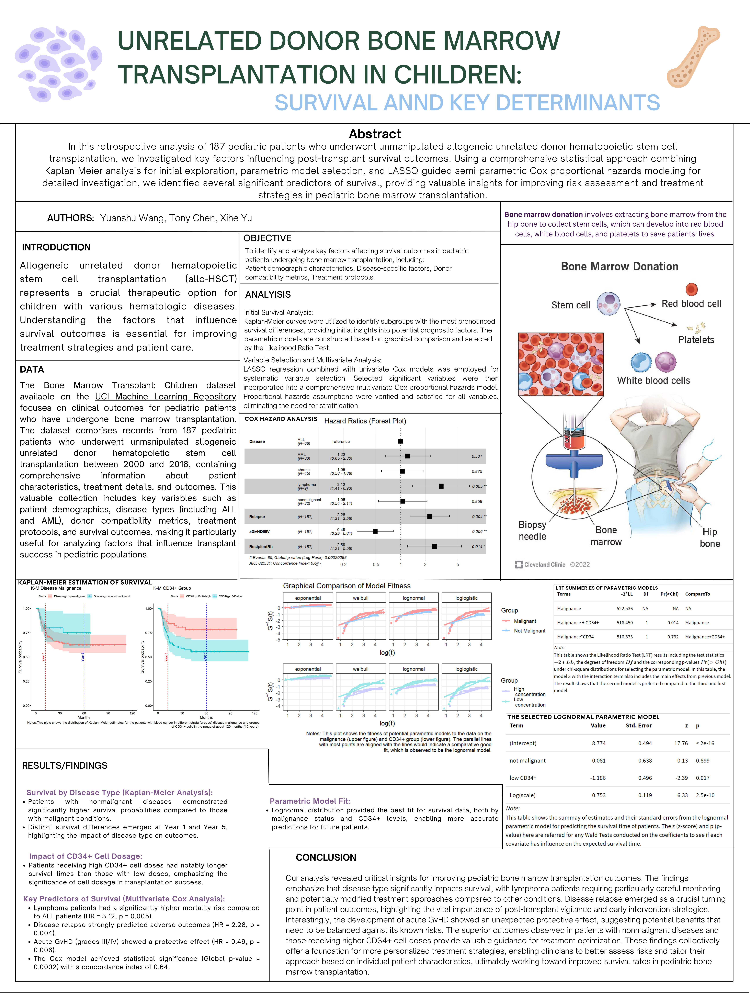

# Pediatric Bone Marrow Transplant Survival Analysis

## Project Summary
This project applies survival analysis to pediatric bone marrow transplant data to identify factors associated with post-transplant survival outcomes.

## Clinical Question
Which patient and treatment variables are linked to higher hazard and poorer survival outcomes?

## Dataset
- `data/bone_marrow_source.arff` (core source)
- Derived files: `data/bone_marrow_raw_export.csv`, `data/bone_marrow_cleaned_final.csv`, `data/bone_marrow_cox_model_dataset.csv`
- Sample size in processed data: 187 observations

## Methodology
- Kaplan-Meier survival estimation
- Log-rank tests across groups
- Cox proportional hazards models (univariate + multivariate)
- Diagnostics for proportional hazards and residual behavior
- Stepwise/selection-based model refinement

## Repository Contents
- `analysis/survival_analysis.Rmd`, `analysis/survival_analysis.qmd`: main analysis notebooks
- `figures/km_curve_overview.png`: representative survival visualization
- `assets/bone_marrow_survival_poster.pdf`: final presentation poster
- `assets/bone_marrow_survival_poster_preview.png`: poster preview image
- `archive/rendered_figures/`: archived rendered chunk-level figure exports
- `archive/poster_materials/`: archived poster files and presentation assets

## Poster
[Open Poster PDF](assets/bone_marrow_survival_poster.pdf)



## How to Reproduce
```r
# In R
rmarkdown::render("analysis/survival_analysis.Rmd")
# or
quarto render analysis/survival_analysis.qmd
```

Required packages include `survival`, `survminer`, `dplyr`, `ggplot2`, `MASS`, `flexsurv`, `forestplot`.
